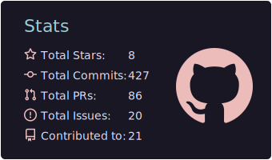
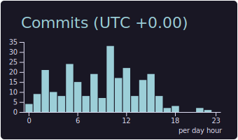
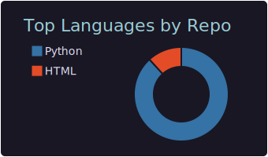
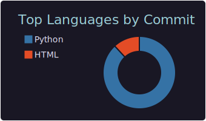

I began programming in junior high, experimenting with random desktop, and mobile development, even cybersecurity. During senior high, while also learning game development I was practicing various other languages, libraries, and tools to satisfy overlapping interests and goals. In college, I discovered my passion for predictive models, which has led me to discover machine learning. My time is now used for practicing and creation of deep learning models.  

  
  
  
  

   
  
   

<!--  active

 

  

-->

<!--  inactive

align="left">  

  - throphy
  

&nbsp;

  -stats

-->
